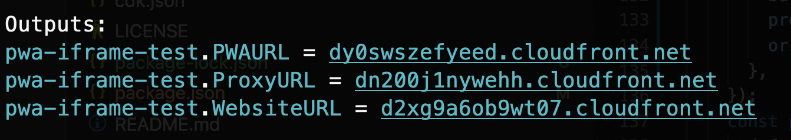

## Initialize

`npm install` or `yarn install`

## Deployment

`cdk deploy`

## Test

When CDK deploy success will display three website URL

1. PWA URL: The PWA demo website to embed Website URL and Proxy URL.
2. Website URL: This is simulate the website has x-frame-options header, it will denied embed web content.
3. Proxy URL: Through CloudFront + Lambda@Edge to fetch Website URL(origin) and remove the x-frame-options header, then embedable this URL, the content is same from Webiste URL.
